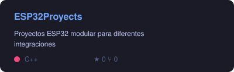
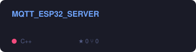
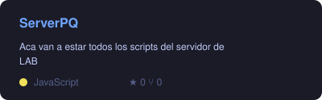
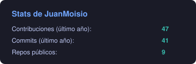
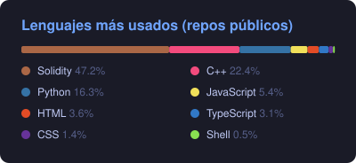

# Hola, soy Juan "Miosio" Moisio 👋

**Ingeniería electrónica + sistemas · Construyo puentes entre hardware y software**

Firmware C/C++ con FreeRTOS · IA 100% local en el edge · Bots que atienden clientes reales · Contratos EVM

---

### 🔭 En qué estoy hoy

- 🛒 **Plataforma de tótems de self-service / self-checkout** (SaaS multi-tenant, en producción en retail y estaciones de servicio): tótem offline-first (Tauri) con catálogo, carrito, **pago QR, tarjeta vía los principales posnets y efectivo**, ticket fiscal y publicidad en pantalla; backoffice (Next.js) para stock, precios, promociones, ventas y reportes; API NestJS multi-tenant con RBAC y tiempo real.
- 📟 **Firmware embebido en serio** (C/C++, FreeRTOS, PlatformIO): una flota de proyectos sobre ESP32/S3/C3 — etiquetas electrónicas de precio con panel central y **OTA**, grabador de audio I2S con transcripción por IA, BMS, GPS tracker, RFID y biometría (huella), control de motores NEMA y cámaras.
- 🏭 **Hardware industrial de punta a punta**: firmware de placas IO propias (protocolo serie, sensores, cerraduras, shutters), **diseño de PCB**, drivers e integración con contadoras y validadores de billetes (C#/.NET 8, XFS, Raspberry Pi + Docker).
- 🗣️ **IA local de punta a punta**: tótem de self-checkout **por voz** para fast food — Whisper (STT) + LLM local vía Ollama + Piper (TTS), **sin internet ni costo por pedido** — y un driver táctil USB propio para macOS con gestos estilo celular.
- 🤖 **Bots de soporte en producción** (WhatsApp): motor modular con flujos JSON, perfiles, reportería y métricas — atendiendo clientes reales todos los días.
- 📱 **Apps que acompañan al hardware**: Android con Kotlin + Compose (Material 3) para las contadoras, apps de escritorio en Swift para macOS.
- ⛓️ **Web3 aplicado**: contratos Solidity testeados con Hardhat y Foundry ([KipuBankV4](https://github.com/JuanMoisio/KipuBankV4) — banco on-chain iterado en 4 versiones).

---

### 🧰 Stack

|  |  |
|---|---|
| **Backend** |     |
| **Datos / Infra** |     |
| **IA local** |    |
| **Embebido / IoT** |       |
| **Protocolos / HW** |     |
| **Apps / Desktop** |   -F05138?style=flat-square&logo=swift&logoColor=white)  |
| **Web3** |     |

---

### 📌 Repos destacados

> La mayor parte de mi trabajo (firmware industrial, kioscos bancarios, bots en producción, IA por voz) vive en repos privados por acuerdos con clientes — si te interesa alguno, escribime y te cuento.

---

### 📊 Actividad

Tarjetas generadas por un workflow propio — se actualizan solas todos los días.

---

### 🤝 Cómo trabajo

- Soluciones **simples, medibles y reproducibles**: documento flujos, dejo scripts y runbooks.
- Me interesa el software que **toca el mundo físico**: si hay un sensor, un motor o un billete de por medio, mejor.
- Abierto a colaborar en herramientas de **operaciones, soporte, IA local y Web3 educativo en LatAm**.

### 📫 Contacto

Abrí un *issue* en cualquiera de mis repos, o escribime por [LinkedIn](https://www.linkedin.com/in/juan-moisio) / [email](mailto:juanchimoisio@gmail.com).
